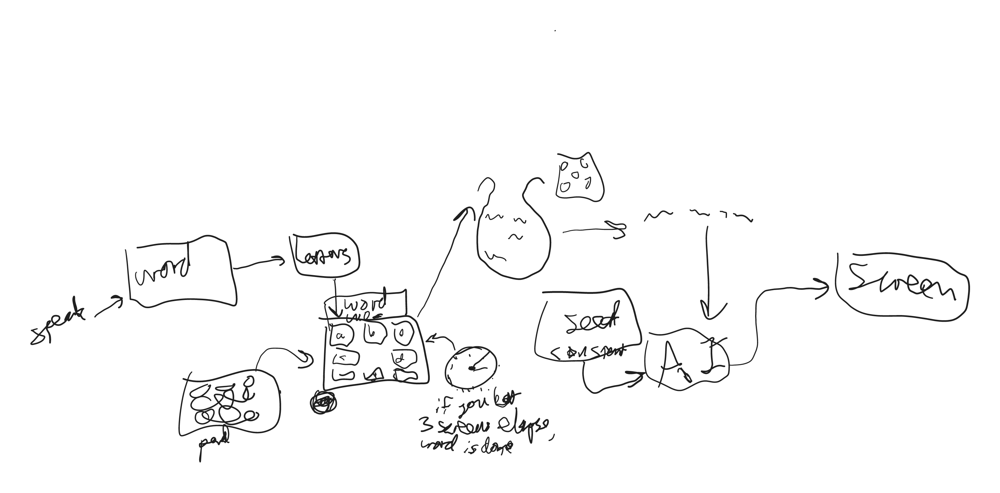

# my-letters-are-drifting



Put the banana keys in `.env`, which should look like this:

```ini
[DEFAULT]
api_key=2222b2d2-22a2-2222-b222-2e222a222d22
model_key=4444b4d4-44a4-4444-b444-4e444a444d44
```